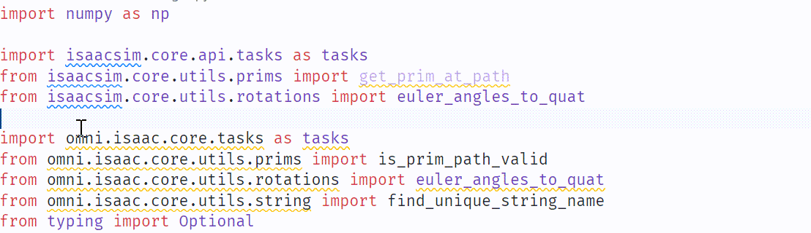

# Isaac Sim Link Manager

> **Note**: This is an English translation fork of the original project by [@SevenFo](https://github.com/SevenFo/manager_isaacsim_link). All credit for the original implementation goes to the original author.

## Introduction
This is a tool for creating symbolic links for Isaac Sim Python packages, designed to improve code auto-completion in IDEs like VSCode. By creating symbolic links from the site-packages directory to Isaac Sim packages, it enables IDEs to correctly recognize and index Python modules and classes from Isaac Sim.



## Features
- Automatically identifies Isaac Sim installation path
- Supports multiple package path structure patterns
- Intelligently creates symbolic links for each subpackage
- Provides safe removal functionality that doesn't affect original files
- Detailed operation logs and error handling

## Requirements
- Python 3.10 or higher
- On Windows, may require administrator privileges or developer mode (for creating symbolic links)
- Only supports `Isaac Sim 4.5` version installed via `pip`

## Installation

```bash
# Clone from GitHub (this English fork)
git clone https://github.com/brainstencil/manager_isaacsim_link.git
cd manager_isaacsim_link

# Install using pip
pip install . # or pip install -e .
```

## Usage

Create links:
```bash
# Using the command line tool
isaacsim-links --create

# Or directly in Python
python -m isaacsim_links.cli --create
```

Remove links:
```bash
isaacsim-links --remove
```

## How It Works
This tool searches for Isaac Sim related packages and extensions in the site-packages directory of your Python environment, then creates symbolic links from these packages to standard import paths. This allows IDEs to find and load these modules, providing code completion, type hints, and other features.

### Search Path Configuration

Refer to the `get_ext_configs` function in `isaacsim_links/core.py` file, you can add or modify search path configurations as needed.

```python
def get_ext_configs():
    """Get extension configurations"""

    # Define extension directories and target locations
    ext_configs = [
        {
            "name": "isaacsim.exts",
            "exts_dir": isaacsim_site_packages / "exts",
            # "prefix": ["isaacsim.", "omni."],
            "prefix": ["isaacsim."],
            "description": "Isaac Sim Standard Extensions",
        },
        {
            "name": "isaacsim.extsPhysics",
            "exts_dir": isaacsim_site_packages / "extsPhysics",
            "prefix": ["isaacsim.", "omni."],
            "description": "Isaac Sim Physics Extensions",
        },
        {
            "name": "omni.extscore",
            "exts_dir": omni_site_packages / "extscore",
            "prefix": ["omni."],
            "description": "Omni Core Extensions",
        },
        {
            "name": "isaacsim.extscache",
            "exts_dir": isaacsim_site_packages / "extscache",
            "prefix": ["isaacsim."], # "omni.", "carb.", modules under isaacsim/extscache/omni/ directory may cause [Error] [omni.kit.window.property.templates.simple_property_widget] Exception when async '<function SimplePropertyWidget._delayed_rebuild at 0x000001E937E2CF70>'
            "description": "Isaac Sim Extension Cache",
        },
    ]

    return ext_configs
```

## Common Issues

### Link Creation Fails on Windows
On Windows, creating symbolic links requires administrator privileges or developer mode. Try running the command prompt as an administrator, or enable developer mode in "Settings -> Update & Security -> For developers".

### IDE Still Cannot Recognize Modules
After creating links, you may need to restart your IDE or reload the Python language server for the IDE to recognize the newly added modules.

## Contributing

This is an English translation fork of the original Chinese project. If you'd like to contribute:

- **For English documentation improvements**: Feel free to submit PRs to this repository
- **For core functionality changes**: Please consider contributing to the [original repository](https://github.com/SevenFo/manager_isaacsim_link) by [@SevenFo](https://github.com/SevenFo)
- **For issues**: Check both repositories to avoid duplicates

## Original Repository

- **Original Author**: [@SevenFo](https://github.com/SevenFo)
- **Original Repository**: https://github.com/SevenFo/manager_isaacsim_link
- **Language**: Chinese (中文) with partial English translation

## License
MIT
